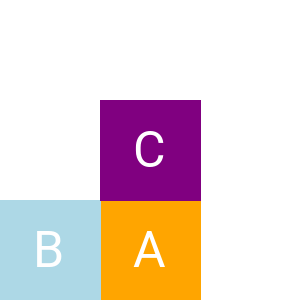
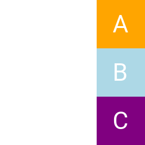
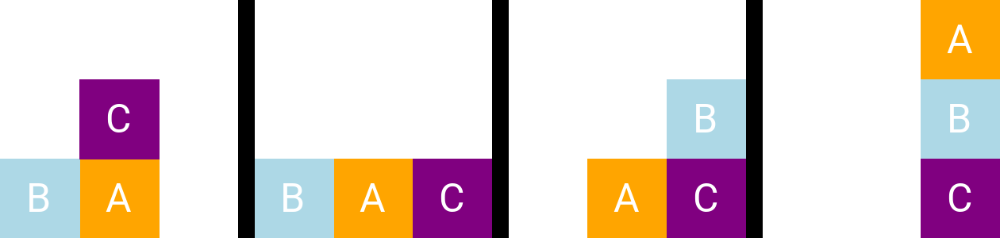

It seeks to solve the "World of blocks" problem (probably goes by many names).

A sample of this problem can be seen below:

  
   

To the left, we have our starting state, and to the right, our target state. 
The idea is to achieve this for any given starting state, and any given target state, using individual moves, and only moving uppermost blocks.
(It is not able to move any given block under another block, nor insert another block under another block).

A sample solution of the given previous sample problem can be seen below:

This project solves that by implementing an interface of possible actions, and transitions via every possible actions, performing a <a href="https://en.wikipedia.org/wiki/State_space_search">State Space Search</a>, thus using various algorithms to solve the problem.
